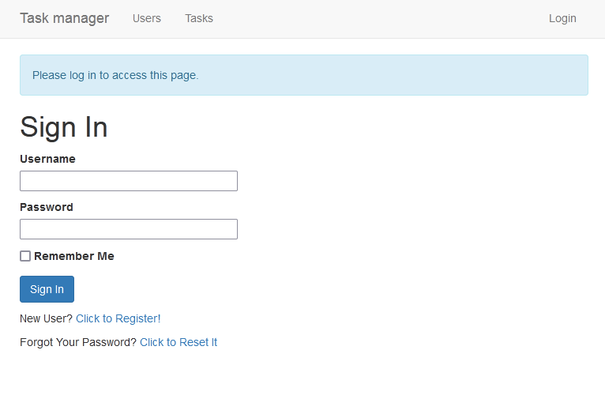
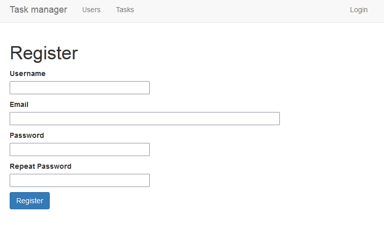
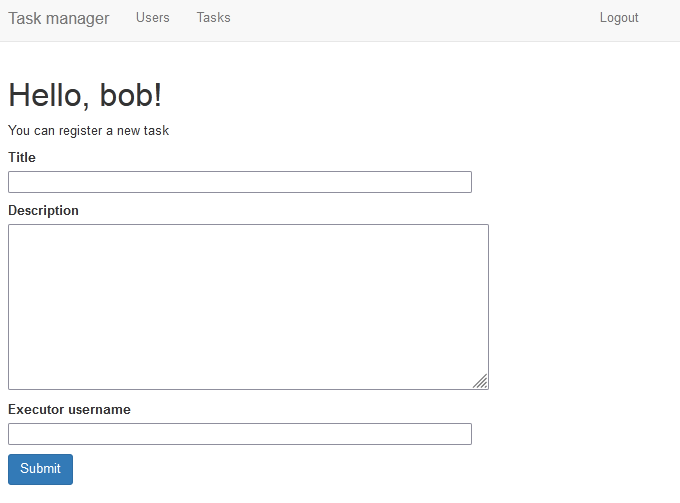
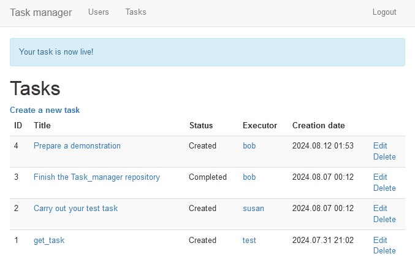
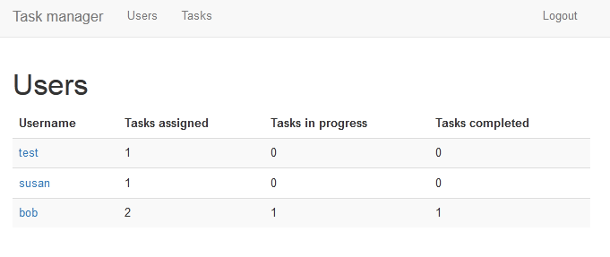
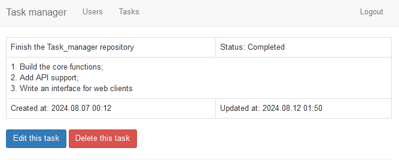
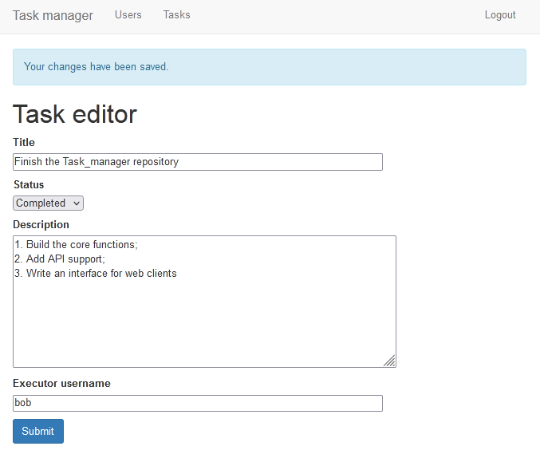
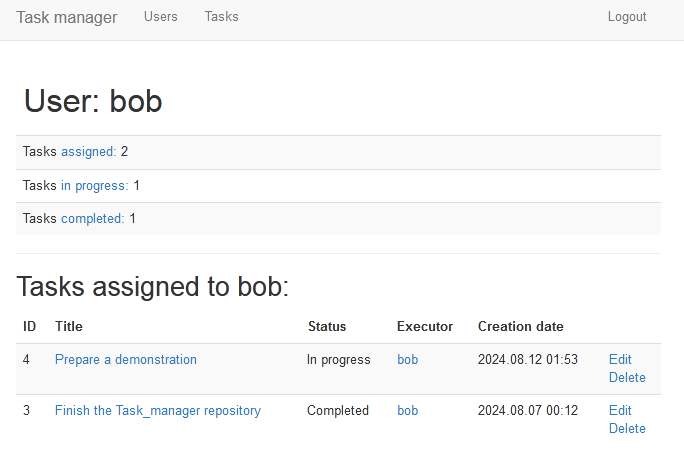
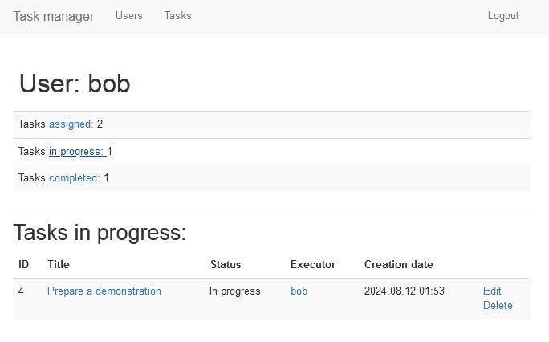

# Task_manager
Flask web application and RESTful API for it
### Application features (web interface)
* User registration;
* Password recovery via email using JWT tokens;
* Tasks creation through a specialized form;
* Browse all registered users/tasks;
* User statistics and a task filter based on it (which works without a page reload);
* Personal task pages with all available information;
* Task editing and removing functionality;
* The application supports task management without using a web interface: see the "API" chapter below.

## Demonstration
|  |  |  |
|-|-|-|
|  |  |  |
|  |  |  |

## Development stages
- [x] HTML templates
- [x] base models
- [x] unit tests
- [x] user credentials processing
- [x] JWT tokens for emails
- [x] API and unit tests for it
- [x] Javascript-based task filter

## API
| HTTP Method | Resource URL | Notes |
| - | - | - |
| `POST` | */api/tasks* | Register a new task |
| `GET` | */api/tasks* | Return the collection of all tasks |
| `GET` | */api/tasks/\<id>* | Return a task |
| `PUT` | */api/tasks/\<id>* | Modify a task |
| `DELETE` | */api/tasks/\<id>* | Delete a task |
### TODO
- [x] add access tokens
- [x] API errors may return JSON responses
- [x] write tests before a merge

## How to
### Run the application
1. `cd Task_manager`
2. Create a virtual environment
3. `pip install -r requirements.txt`
4. `flask run`
5. Navigate to `http://127.0.0.1:5000/` in your browser
6. Use the following credentials to log in
```
login: test
password: test
```

### Run the tests
1. Activate the virtual environment
2. `python tests.py`

### Check the password reset feature
1. Run the application
2. Start an emulated email server: `python -m smtpd -n -c DebuggingServer localhost:<your_port>`
3. Set two environment variables
```
export MAIL_SERVER=localhost
export MAIL_PORT=<your_port>
```
4. Navigate to `http://127.0.0.1:5000/reset_password_request` (can be done through the login page)
5. Request password reset for this email: `test@example.com`
6. Check the server for the reset link

### Check the application API
1. Activate the virtual environment
2. Get a token from `http --auth test:test POST http://localhost:5000/api/tokens`
3. Run any of the following commands (add these keys and values: `-A bearer --auth <token>`)
* `http GET http://localhost:5000/api/tasks/1`
* `http GET http://localhost:5000/api/tasks`
* `http POST http://localhost:5000/api/tasks title="API test" description="check any API route" executor_id=1`
* `http PUT http://localhost:5000/api/tasks/1 title="endpoint check"`
* `http PUT http://localhost:5000/api/tasks/1 description="send HTTP request to any API route"`
* `http PUT http://localhost:5000/api/tasks/1 status="Completed"`
* `http DELETE http://localhost:5000/api/tasks/1`

## Possible improvements
* [code structure] use the application factory pattern;
* add pagination for the user and task lists;
* multi-user support for a single task;
* add a reviewer role, without whose consent it won't be possible to set the status "completed" or change the task
